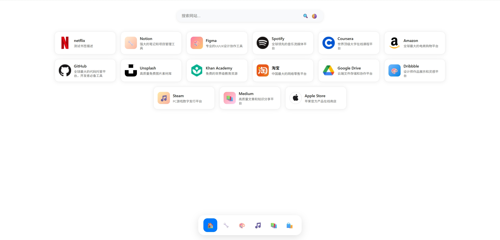
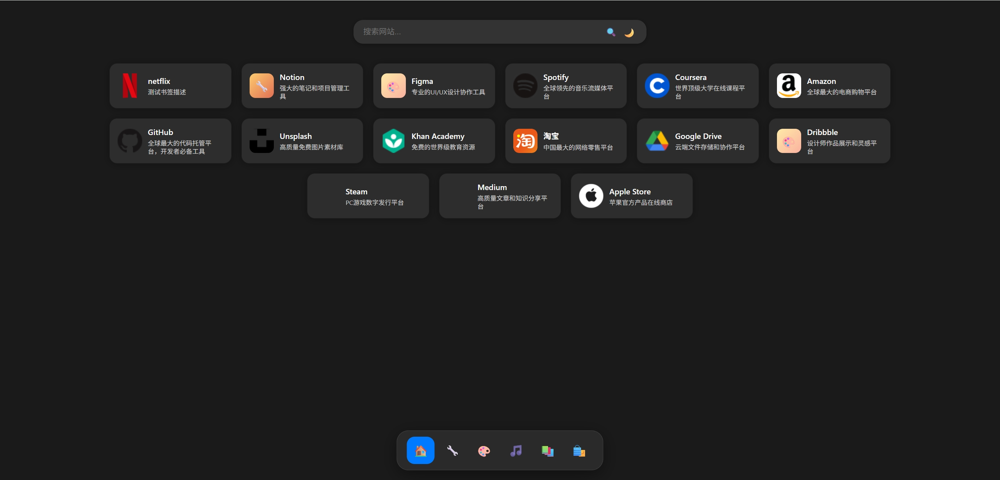
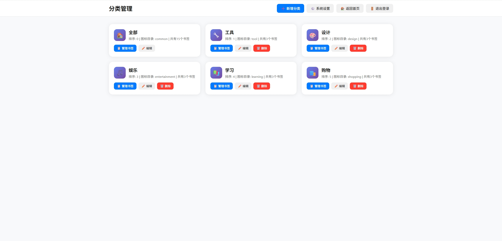

# 极简网站导航系统

一个极简风格的网站导航界面，采用前后端分离架构，支持分类管理、书签管理和图标上传功能。

<p align="center">
  
</p>

<p align="center">
  
</p>

<p align="center">
  
</p>

## 功能特性

### 前端展示页面
- **极简设计**：白色背景，圆角矩形，柔和灰色阴影
- **Dock 风格**：半透明导航栏，悬停放大效果
- **响应式布局**：自适应不同屏幕尺寸
- **实时搜索**：支持按名称、简介、标签搜索
- **分类过滤**：点击 Dock 图标显示对应分类书签

### 后台管理系统
- **登录验证**：账号密码认证，自动超时退出
- **分类管理**：自定义分类名称、图标、排序、上传目录
- **书签管理**：完整的增删改查功能
- **图标上传**：支持本地图标上传，按分类存储
- **数据持久化**：基于 JSON 文件的轻量级存储

## 技术栈

- **后端**：Go 1.21+ (Gin框架)
- **会话管理**：Gin Sessions (基于Cookie)
- **文件上传**：内置multipart处理
- **数据存储**：JSON文件
- **前端**：原版HTML/CSS/JavaScript

## 项目结构

```
navdesk/
├── README.md               # 项目文档
├── go.mod                  # Go模块文件
├── main.go                 # Go服务器入口
├── models/                 # 数据模型
│   └── models.go
├── storage/                # 存储层
│   └── storage.go
├── handlers/               # 路由处理器
│   ├── auth.go              # 认证处理
│   ├── categories.go        # 分类管理
│   ├── bookmarks.go         # 书签管理
│   ├── upload.go            # 文件上传
│   └── settings.go          # 设置管理
├── middleware/             # 中间件
│   └── auth.go              # 认证中间件
├── data/                   # 数据存储目录
│   ├── users.json           # 后台账号配置
│   ├── categories.json      # 分类数据
│   ├── bookmarks.json       # 书签数据
│   ├── settings.json        # 全局设置
│   └── uploads/             # 图标上传目录
├── public/                 # 静态文件
│   ├── index.html           # 前端展示页面
│   └── admin/               # 后台管理页面
├── Dockerfile              # Docker文件
├── Dockerfile-Buildx       # Docker多平台文件
├── docker-compose.yml      # Docker Compose配置
└── entrypoint.sh           # Docker启动脚本
```

## 快速开始

### 环境要求
- Go 1.21 或更高版本

### 本地运行

```bash
# 克隆项目
git clone SStarbuckS/navdesk
cd navdesk

# 下载依赖
go mod tidy

# 运行项目
go run main.go

# 或构建后运行
go build -o navdesk
./navdesk
```

### Docker 部署

本项目支持完整的Docker数据持久化方案，

```bash
# 快速开始
docker run -d -p 3000:3000 -v /home/nav-data:/app/data --name navdesk sstarbucks/navdesk:latest

# 使用Docker Compose (推荐)
docker-compose up -d

# 查看日志
docker-compose logs -f

# 停止服务
docker-compose down
```

# docker-compose.yml

```yaml
services:
  navdesk:
    image: sstarbucks/navdesk:latest
    container_name: navdesk
    restart: always
    ports:
      - "3000:3000"
    environment:
      TZ: Asia/Shanghai
      GIN_MODE: release   # 生产模式 默认debug
    volumes:
      - ./data:/app/data
``` 

## 访问方式

启动成功后访问：

- **前端页面**: http://localhost:3000
- **后台管理**: http://localhost:3000/admin
- **默认账号**: admin / 123456

## 配置说明

### 环境变量
- `PORT` - 服务端口 (默认: 3000)
- `SESSION_SECRET` - Session密钥 (默认: your-secure-random-key-2025-navdesk-session)
- `GIN_MODE` - Gin运行模式 (release/debug)

### 数据文件
所有数据存储在 `data/` 目录下的JSON文件中：
- `users.json` - 用户账号信息
- `categories.json` - 分类数据
- `bookmarks.json` - 书签数据
- `settings.json` - 系统设置
